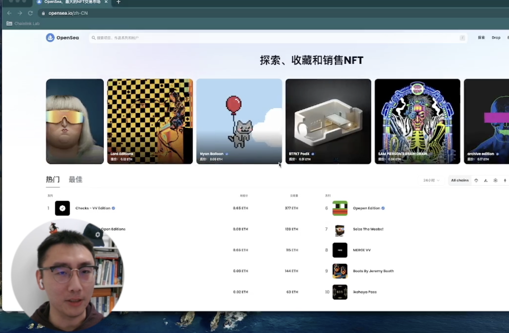
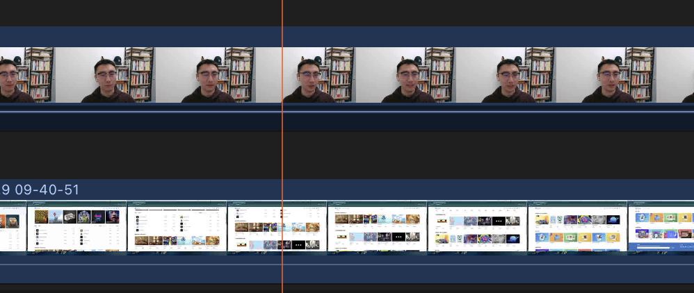
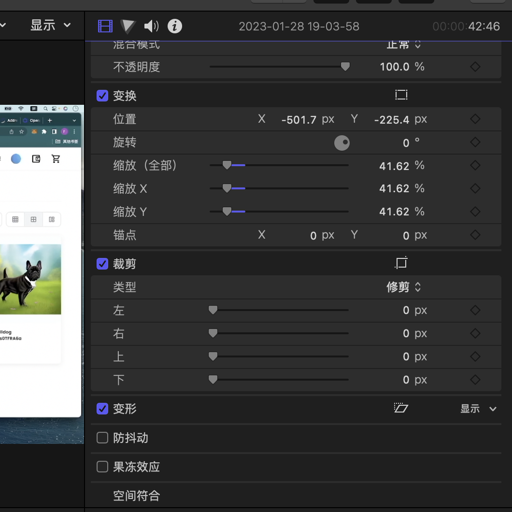
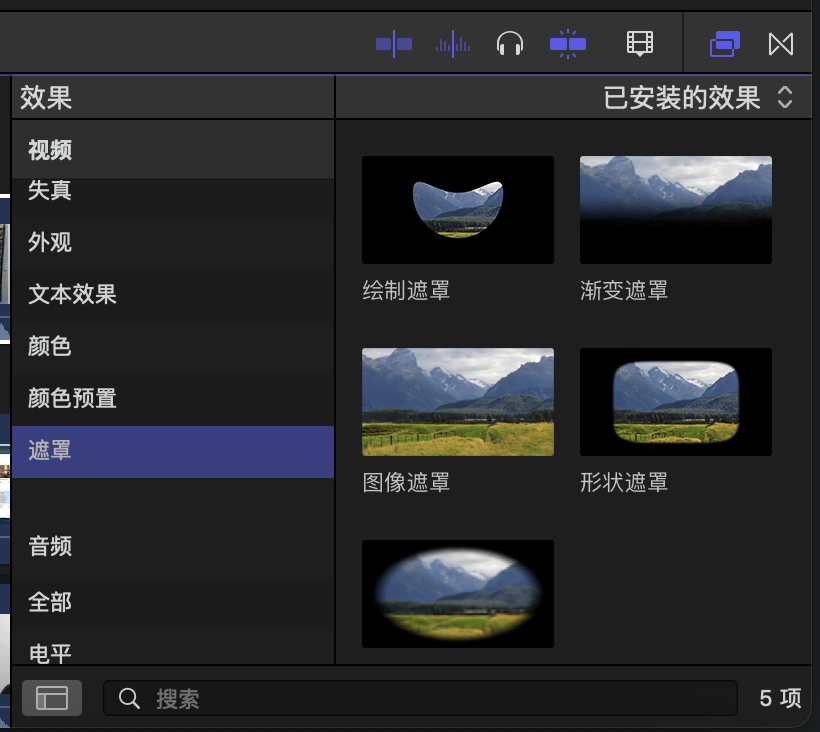
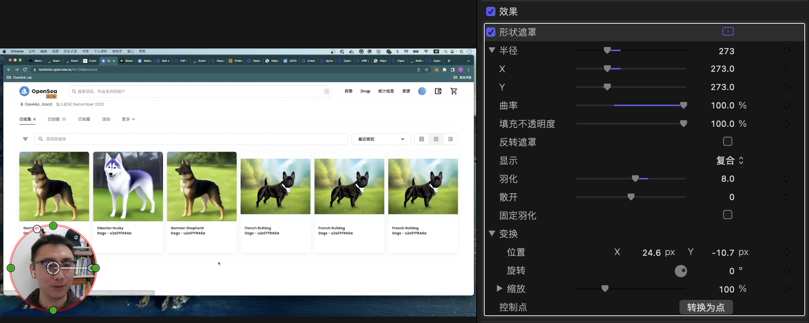

# 给视频加入圆形遮罩

有的时候，想要在视频中达到这样的效果，就是在视频讲解中加入自己的头像：

关键字是遮罩，实现方法是：

1. 加入一个新的涂层，也就是要展示为头像的涂层

2. 在涂层中通过“变换（transform）”缩小该视频涂层，一直到合适在视频中展示的大小。
   

3. 在涂层中加入遮罩

4. 调整遮罩，主要调整的参数是：曲率（四个角的圆滑程度），半径（调整圆的程度），羽化（边界是清晰还是模糊化处理）
   

## 补充资料
https://www.youtube.com/watch?v=nkCvOjMEeuI