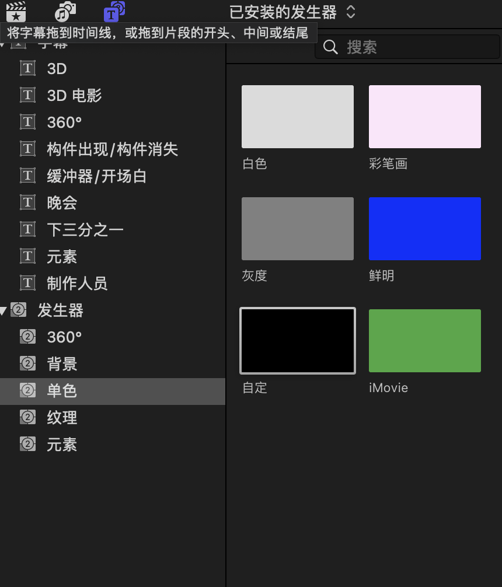

# 插入黑色背景以及提示词
## 插入黑色背景
关键词:"FCP black screen add"
步骤：
1. 切换到 title 的选项卡

2. 在选项卡中选择 generator（发生器）

3. 发生器中选择 solid（纯色）
   

这样就可以在任意位置加一段黑屏，然后可以在黑屏上写字，以提醒观众一些内容。

## 在黑色背景中加入提示词
就和加入字幕的方式一样。
1. 在字幕中选择一种字幕

2. 拖到下面的视频条中

3. 补充字幕文字

## 补充资料
https://youtu.be/1LnwN969Usw