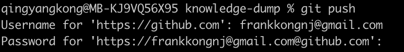
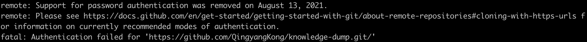
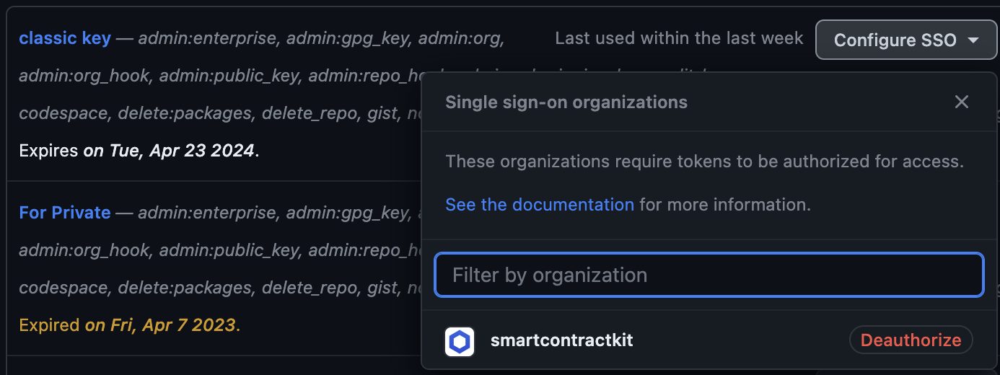

# 如何使用 GitHub 的 token
如果在本地想要将代码通过 git 命令 push 给 remote 的 GitHub repo，需要配置 token，否则每次都要输入用户名和密码，如下图所示：


但是这样的方式现在也已经被废弃了，因为就算你输入了密码，也会遇到以下的错误。

这种验证方式在 2021 年 8 月 13 日久废止了，所以还是要使用 token 来解决远程验证问题。

当然也可以使用 SSH 的 key 来做同样的事情，但是 GitHub 官方现在推荐的方式是 token，相较于 SSH key，token 有一些优势，详细可以看这个回答：[In what ways is an SSH Key different from tokens for git authentication?](https://stackoverflow.com/questions/67077837/in-what-ways-is-an-ssh-key-different-from-tokens-for-git-authentication)

如何使用 token，记录在了这里
[github访问令牌token的创建方法](https://zhuanlan.zhihu.com/p/501872439)，步骤如下：

在 profile -> settings -> Personal access token -> Tokens(classic) 中生成一个所需权限的 token。

即使用生成的 token 添加一个新的 remote。比如生成的 token 是`ghp_xxxxxxxxxxxxx`，通过以下的命令添加这个 token。

```
git remote add originnew https://{token}@github.com/smartcontractkit/functions-hardhat-starter-kit.git
```
这个可以让开发者在使用这个 remote 的时候自动使用到生成的 token。

```
git push originnew
```
通过新的 remote 来推送代码

## 2FA
如果公司使用 SAML 的话，需要将这个 token 授权给这个 SAML。如下图所示：
