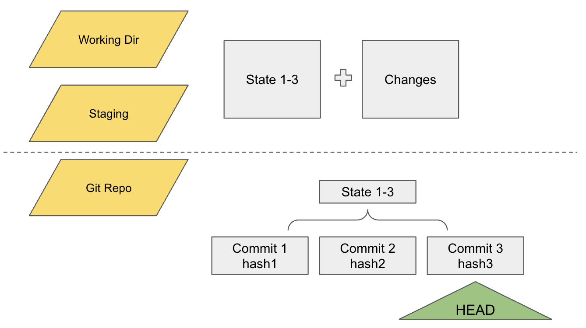
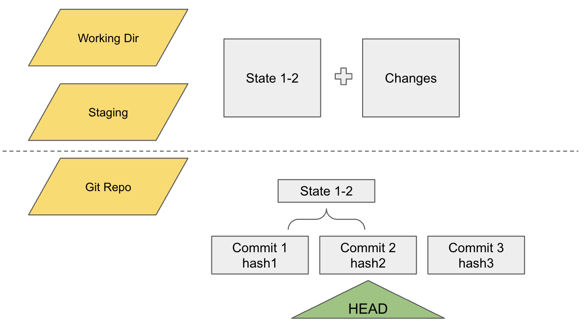

# 如何查理解 checkout 命令
## HEAD 的定义
先查看 https://www.cloudbees.com/blog/git-detached-head

git repo是由很多个 commit 所组成的，branch 和 tag 就是这些 commit 中的标签，记录某一个 commit 哈希。同样的，HEAD 也是 commit 的标签。如下图所示：


## detached HEAD
一般 HEAD 都代表着当前的 branch 最新的 commit，如果发生了错位，就会变成 detached HEAD，如下图所示：


当使用命令`git checkout <commit hash>`的时候，就会把定位在这个commit hash之前的内容全部写到working directory。

当用户使用命令 `git checkout <branch name>`的时候，就是将 HEAD 移动到不同的分支上的最新commit。

## 解除 detached HEAD 状态
解除 detached HEAD 有两种原因：

1. 只是查看当前 tag 的代码，然后切换回主分支。这种情况下使用命令 `git checkout <branchName>`即可切回去。

2. 做了一些修改想要保留，但是在 DETACHED 状态，不能commit。如果要 commit 所做的修改，就需要新建一个 branch，然后将当前的修改 commit 到当前的 branch。使用命令
```
git branch <branchName>
git checkout <branchName>
```
## 文件存在的三种状态
在使用 git 的时候，有三种不同的状态，在本地进行开发和修改的是 Working Directory，已经commit 的是 git repo，还有只add但是还没有commit的staging状态。

`checkout`命令可以将 HEAD 调整到不同的 commit hash，同时还会将当前的working diretory 以及 staging 的状态调整到和 git repo一致。但是对于在 working directory 和 staging 中做出的修改，将保留。

入下图所示：


checkout 之前，HEAD 指向最新的 commit，同时用户在 working directory 和 staging 做出来修改。


checkout 之后，HEAD 指向 commit 2，同时用户在 working directory 和 staging 的状态发生了变化但是还未commit的 changes 不变。